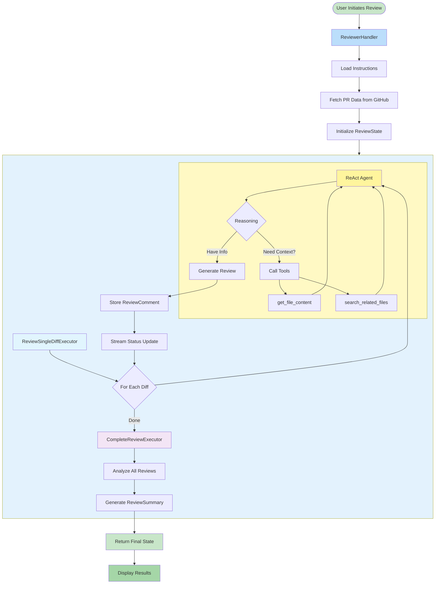
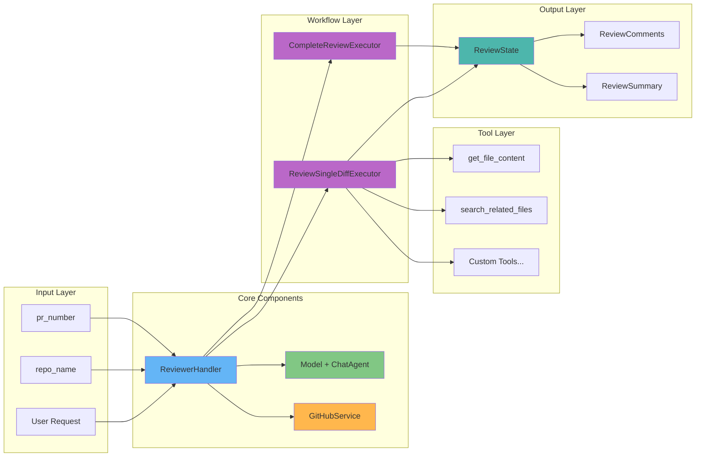
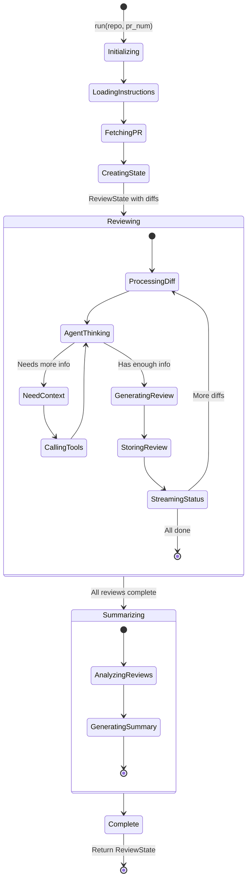
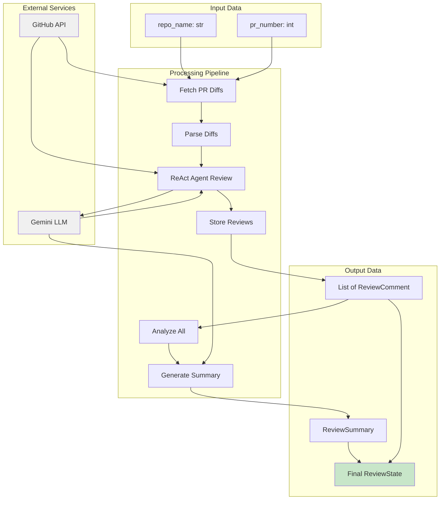
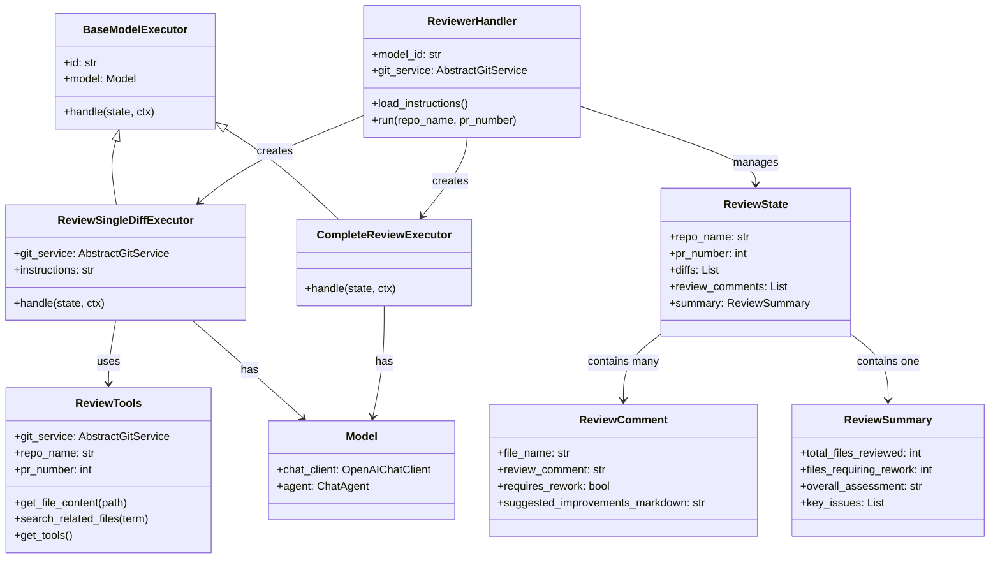
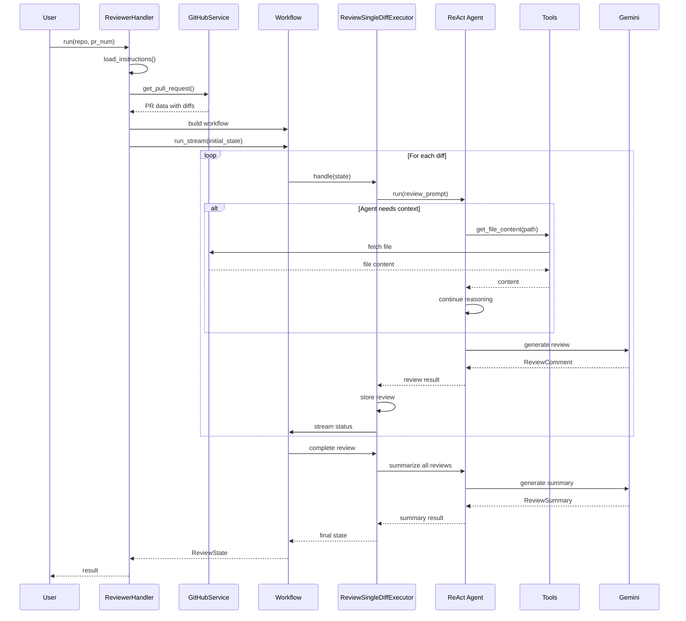
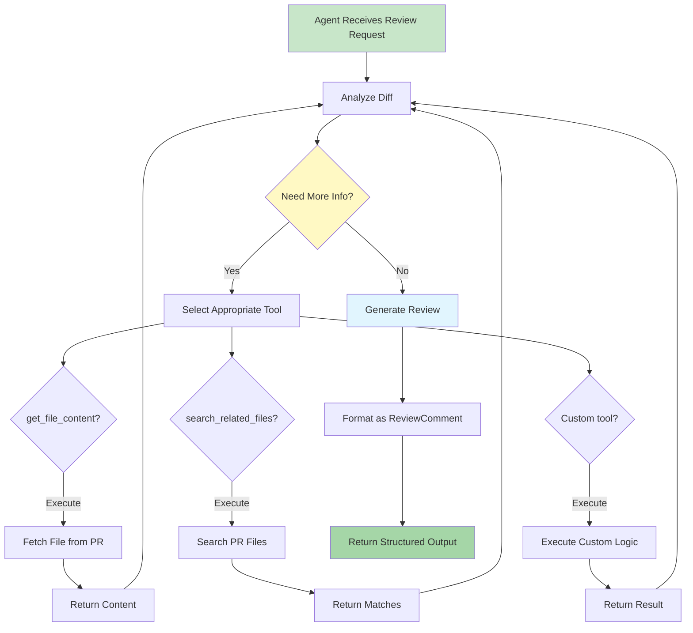

# Agent Framework Code Reviewer - Visual Architecture

## Complete System Diagram

## Detailed Component Breakdown

## State Flow Diagram

## Data Flow Diagram

## Class Hierarchy

## Sequence Diagram - Review Flow

## Tool Interaction Pattern

## Copy these diagrams into documentation or use with Mermaid Live Editor:

## https://mermaid.live/
